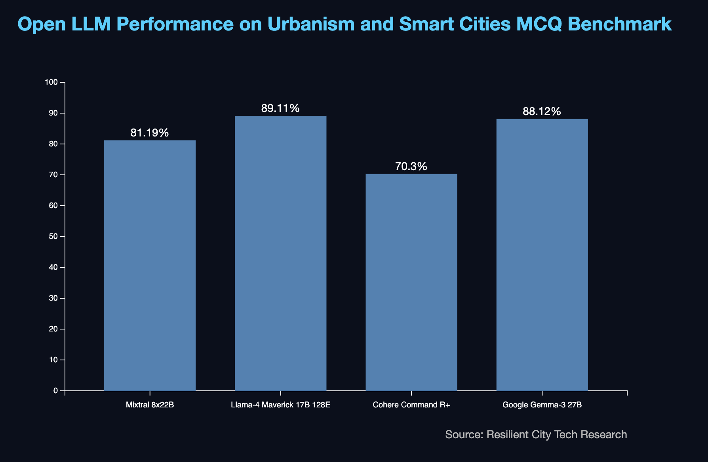
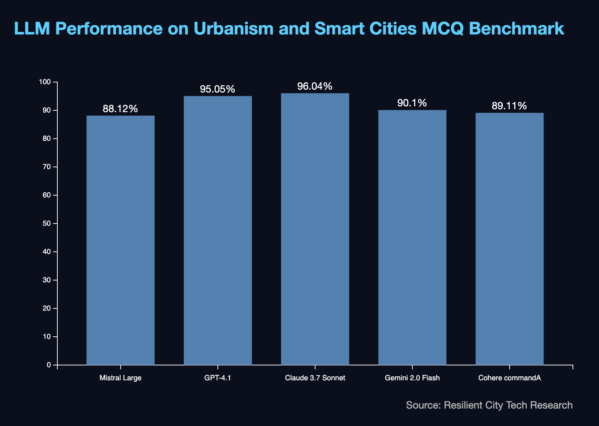

# Urbanism and Smart Cities MCQ Benchmark

In this research, we tested different Large Language models on urban-related questions dataset.

## Open LLMs/AI models Performance

## Results for proprietary models with closed AI model weight.

Key Results for proprietary models:

* Claude 3.7 Sonnet leads with highest score: 96.04%
* GPT-4.1 follows closely behind: 95.05%
* Gemini 2.0 Flash, Cohere commandA, and Mistral Large trail with scores of 90.1%, 89.11%, and 88.12% respectively
* All LLMs performed strongly with scores above 88%
* Notable performance gap (6-8%) between the top two models and the rest

There are 101 questions in this dataset, but we try to select and create different types of questions.

If you are an architect, urbanist, or environmental activist working with cities or have any ideas for urban-related questions and datasets, please contribute to the project by submitting a pull request on our repository.
